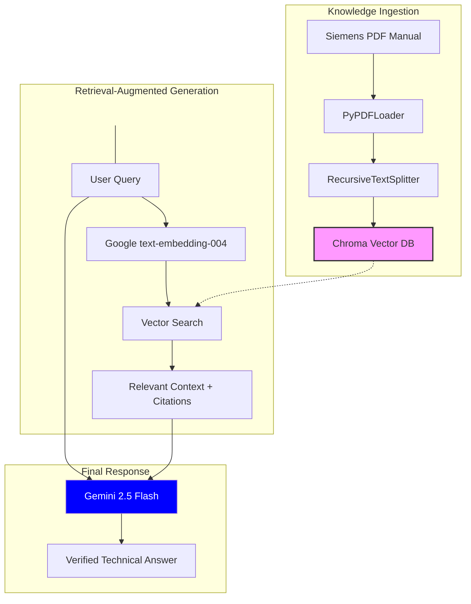

# 🏭 Industrial RAG Assistant: Siemens S7-1200 Expert

An enterprise-grade technical assistant utilizing Retrieval-Augmented Generation (RAG) to query 1,500+ pages of the Siemens S7-1200 System Manual.

## 💎 Core Capabilities
- **Semantic Retrieval**: Leverages vector embeddings to interpret technical intent beyond simple keyword matching.
- **Audit-Ready Citations**: Every response is mapped to the exact page number of the source PDF for technical verification.
- **Industrial Safety Focus**: Designed to minimize "search latency" for field engineers while providing direct links to official documentation.

##  💻 Technical Infrastructure
- **LLM**: Google Gemini 2.5 Flash
- **Vector DB**: ChromaDB
- **Framework**: LangChain Classic
- **UI**: Streamlit

##  🛠️ Deployment Guide
1. Clone Repository: `git clone https://github.com/alirezasoroushe/industrial-rag-assistant.git`
2. Environment Configuration: `pip install -r requirements.txt`
3. Authentication: `.env` with your `GOOGLE_API_KEY`.
4. Initialize Application: `streamlit run app.py`

## 🛠️ Project Troubleshooting & Industrial Insights
Building this system in the fast-evolving AI landscape presented several "real-world" challenges. Below are the technical hurdles overcome and the "Pro-Tips" for deploying RAG in industrial environments.

### 1. Handling API Deprecations (The "404 NOT_FOUND" Challenge)
**Problem:** Initially, the project used `gemini-1.5-flash`. However, as of early 2026, Google retired these legacy identifiers, leading to `404` errors in the `v1beta` API.
**Solution:** Migrated the logic to the **Gemini 2.5 Flash** stable release. 
**Tip:** Always hard-code specific model versions (e.g., `gemini-2.5-flash`) rather than using `-latest` tags in production to prevent breaking changes when models are updated.

### 2. LangChain Modularization (ModuleNotFoundError)
**Problem:** LangChain split its core logic from community integrations, causing imports like `RetrievalQA` to fail. 
**Solution:** Installed `langchain-classic` and updated import paths to `langchain_classic.chains` to bridge the legacy logic with the new 2026 framework.
**Tip:** Use a virtual environment (Conda or Venv) to isolate dependencies, ensuring that "Community" packages don't conflict with "Core" AI logic.

### 3. Precision Over Performance
**Problem:** Standard semantic search sometimes missed specific Siemens part numbers or error codes.
**Solution:** Implemented a **1000-character chunk size with a 200-character overlap**. This ensures that technical specs aren't "cut in half," maintaining the context of safety warnings.
**Tip:** In RAG systems for manuals, **Metadata is King**. By preserving the `page` number in the metadata, we provide a "human-in-the-loop" verification step, essential for industrial safety standards.

### 4. Embedding Model Synchronization
**Problem:** Using a 2024 embedding model with a 2026 LLM caused "dimensionality mismatch" errors.
**Solution:** Standardized the entire pipeline on the `text-embedding-004` engine to ensure the "Brain" and the "Memory" speak the same mathematical language.
## 🏗️ System Architecture

    
